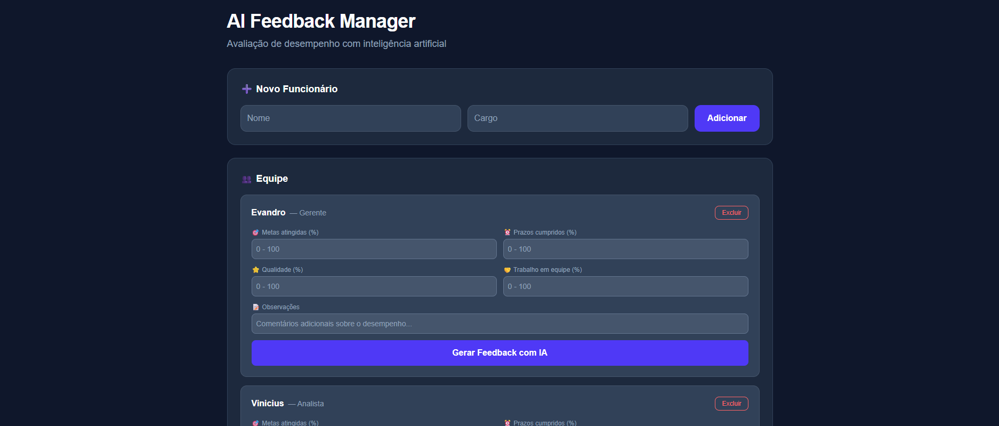

# 🤖 AI Feedback Manager

> Avaliação de desempenho de equipes com inteligência artificial.


**[🔗 Acesse o projeto ao vivo →](https://ai-feedback-seven.vercel.app)**



---

## 📋 Sobre o Projeto

O **AI Feedback Manager** é uma aplicação web que utiliza inteligência artificial para auxiliar na avaliação de desempenho de funcionários. A ferramenta permite cadastrar colaboradores e gerar feedbacks inteligentes e personalizados com base em seus dados de performance.

---

## 🚀 Funcionalidades

- ➕ Cadastro de funcionários
- 👥 Visualização da equipe
- 🤖 Geração de feedback com IA
- 📊 Avaliação de desempenho automatizada

---

## 🛠️ Tecnologias

### Frontend
- [Next.js](https://nextjs.org/) — Framework React
- [Vercel](https://vercel.com/) — Deploy e hospedagem

### Backend
- [Python](https://www.python.org/) — Linguagem principal
- API de IA para geração de feedbacks

---

## 📁 Estrutura do Projeto

```
ai-feedback/
├── frontend/       # Aplicação Next.js
├── backend/        # API Python
└── .gitignore
```

---

## ⚙️ Como Rodar Localmente

### Pré-requisitos

- Node.js 18+
- Python 3.10+
- npm ou yarn

### 1. Clone o repositório

```bash
git clone https://github.com/ViniciusChavari/ai-feedback.git
cd ai-feedback
```

### 2. Configure o Backend

```bash
cd backend
pip install -r requirements.txt
python main.py
```

### 3. Configure o Frontend

```bash
cd frontend
npm install
npm run dev
```

Acesse `http://localhost:3000` no navegador.

---

## 🌐 Deploy

O frontend está hospedado na **Vercel** e pode ser acessado em:
👉 [https://ai-feedback-seven.vercel.app](https://ai-feedback-seven.vercel.app)

---

## 🤝 Contribuindo

Contribuições são bem-vindas! Sinta-se à vontade para abrir uma *issue* ou enviar um *pull request*.
